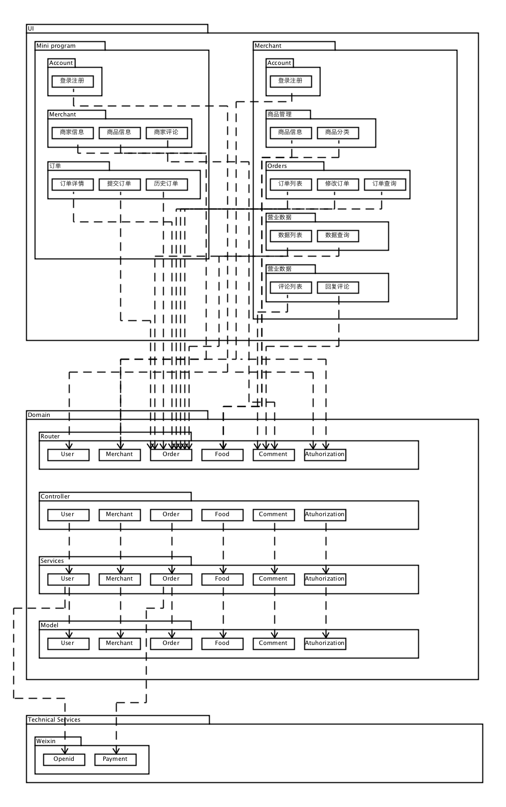

# 软件架构文档

Version: `1.0`

Release Date: `30 Jun. 2018`

## 架构

### 服务端

#### 解决方案

服务端采用Golang架构，按照RESTful API原则和http请求接收来自前端的请求，并提供相应的服务

### 客户端

**即点餐程序和商家管理程序**

#### 考虑问题

**点餐程序**

* 用户能够快速方便的进行扫码点餐，切符合日常使用app的习惯
* 能够调用当今比较热门的支付方式
* 点餐程序的性能满足点餐需求，一定要迅速，不能有超过秒级的加载缓慢
* 有利于开发人员快速开发

**商家管理台**

* 跨平台（暂不考虑手机）
* 能够实现异步加载，并且是单页面应用，减少资源消耗和加快加载速度
* 代码清晰、模块化
* 有利于快速开发

#### 解决方案

点餐程序采用微信小程序开发，商家管理程序采用Vue框架开发

## 逻辑视图

服务端共分为以下四个模块

* router：接收请求并分发给对应的controller
* controller：处理http请求，根据请求调用服务
* model：数据库对象

## 物理视图

