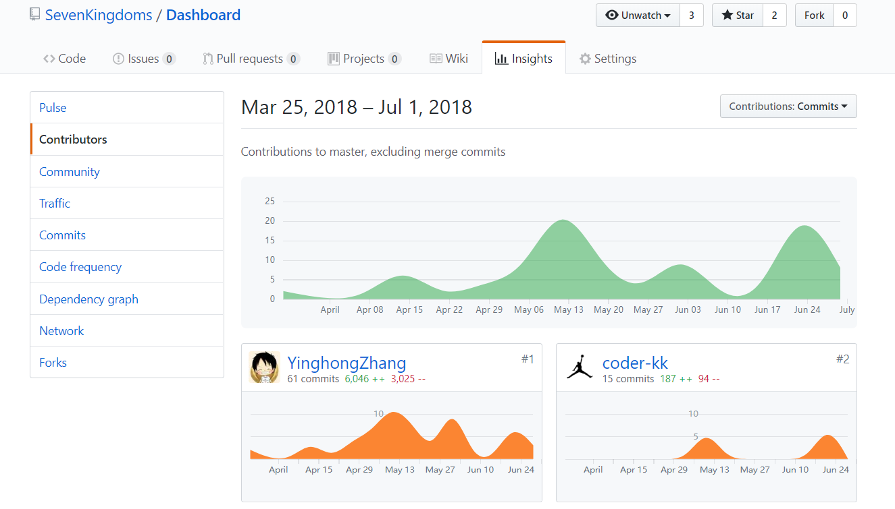
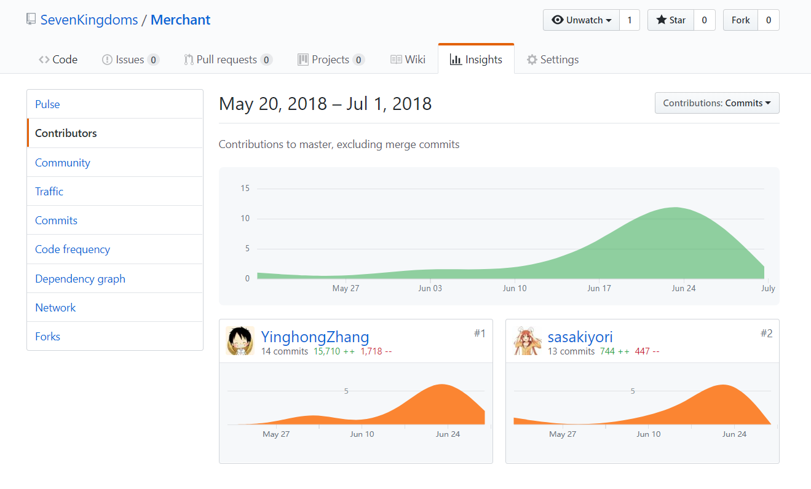

## Final Report

`github: YinghongZhang`

### 个人总结

#### 我负责的工作如下：

* 项目管理、需求分析、业务分析
* 商家管理台的编码（web端）

#### 是否达到期望？

* 最终效果没有达到个人期望
* 需求分析存在很多不足的地方
* 项目整个流程，理解尚且非常浅薄
* 项目进度也有较多拖延现象

#### 可以改进的地方

* 项目经理应尽早进行需求分析，将软件的整体需求告知团队成员并让他们理解、认可
* 早期阶段要对需求不断细化分析，重要的功能需要提前确定下来，防止后期有大的改动
* 项目经理要时常跟进项目进度，按照我们项目大概15周的时间，最少也要一周做一次验收、提醒，保证项目进度
* 跟进老师上课进度，前期的用例、活动图、领域模型、状态图和系统功能图是梳理需求的重要工具也是帮助开发人员理解业务需求的工作之一，这些工作都不能马虎，会直接影响到项目整体进度。但到了后面课程，没听懂逻辑架构物理视图，虽然这对实际编码进度影响不是特别大，但不整理一下就很难理解软件的架构以及做优化。

### Git总结报告

### 个人工作清单

* 需求分析、编写业务文档、项目管理
* 验收审核团队成员的工作，保证项目进度
* 参与决定项目采用的软件框架
* 商家管理台（web端）架构和编写代码

### 个人劳苦清单

* 这么多uml图要画，奇奇葩葩的，好不累人和烧脑！

### PSP2.1

|                PSP2.1                 |     PSP阶段      | 预估耗时(小时) | 实际耗时(小时) |
| :-----------------------------------: | :------------: | :------: | :------: |
|               Planning                |       计划       |    2     |    2     |
|               Research                |      前期调研      |    4     |    4     |
|               Analysis                |      需求分析      |    22    |    35    |
|              Design Spec              |     生成设计文档     |    8     |    12    |
|             Design Review             |      设计复审      |    3     |    4     |
|            Coding Standard            |      代码规范      |    1     |    1     |
|                Design                 |      具体设计      |    5     |    10    |
|                Coding                 |      具体编码      |    28    |    40    |
|             Code Reiview              |      代码复审      |    4     |    4     |
|                 Test                  |       测试       |    6     |    8     |
|               Reporting               |       报告       |    2     |    2     |
|              Test Report              |      测试报告      |    2     |    2     |
|           Size Measurement            |     计算工作量      |    2     |    2     |
| Postmortem & Process Improvement Plan | 事后总结，并提出过程改进计划 |    2     |    2     |
|                                       |       合计       |    91    |   128    |
