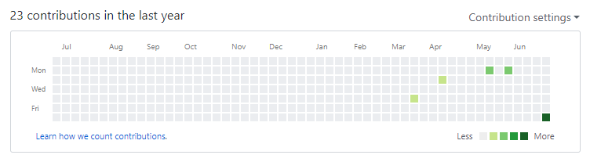

### Final Report

---

- 课程学习总结报告：

  通过这个学期的学习和开发，我初步了解了一个项目应该分块、分专项内容、分方向来进行，每个人负责独立的一部分，并且通过项目开始就设计好的原型、UI、(API)文档来规范项目开发。而项目的设计也需要根据时间预算和任务来设计思路流程，并且一个很重要的必要步骤就是需要审查。

  开发过程中需要依据官方文档来，就这次而言，我差不多把小程序的常用的文档和接口都看过了一遍，并且在看的过程中也需要理解各个部件的作用和思考在本项目中能否起到作用，这样在开发过程中就会得心应手。

  并且在这次项目中，非常感谢[@Kobe3](https://github.com/Kobe3)同学，他指导了我的开发过程中遇到的各种问题，也不惜花费自己宝贵的时间来指导我开发。

  并且在这次项目中，对git的分布式多人协作开发的流程有了一定的了解，也掌握了代码的分支管理等内容。

- PSP2.1 统计表

| PSP2.1            | Personal Software Process Stages     | Time (%) Senior Student | Time (%) |
| ----------------- | ------------------------------------ | ----------------------- | -------- |
| Planning          | 计划                                 | 10                      | 8        |
| · Estimate        | 估计这个任务需要多少时间             | 10                      | 12       |
| Development       | 开发                                 | 10                      | 12       |
| · Analysis        | 需求分析 (包括学习新技术)            | 12                      | 7        |
| · Design Review   | 设计复审                             | 4                       | 4        |
| · Coding Standard | 代码规范                             | 2                       | 4        |
| · Design          | 具体设计                             | 10                      | 4        |
| · Coding          | 具体编码                             | 12                      | 8        |
| · Code Review     | 代码复审                             | 5                       | 4        |
| · Test            | 测试（自我测试，修改代码，提交修改） | 8                       | 10       |
| Reporting         | 报告                                 | 4                       | 4        |
|                   | 计算工作量                           | 3                       | 2        |
|                   | 并提出过程改进计划                   | 3                       | 1        |

- 
- 在这次项目中， 我主要负责了从提交结算开始的支付页面的设计和开发流程。这包括了从之前的页面中读取订单页面的信息和上传结算结果给后台服务器作为记录给其他页面调用。并且也调用了微信的一些接口（wx:showToast）作为消息提示，用来作为验证一些必要的输入框的填写。
