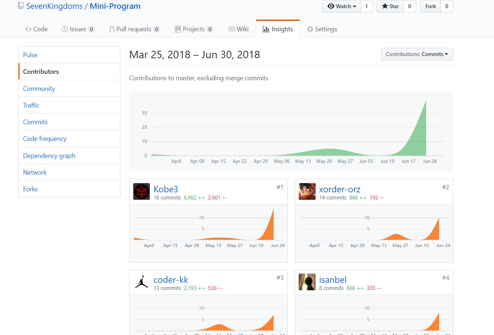
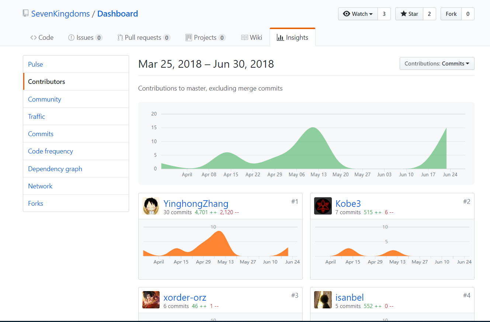

## 15331387-kobe3

#### 1.个人总结

感谢各位大佬的照顾，让我学到那么多东西。

#### 2.git统计报告

#### 3.工作清单

- 参与api文档部分设计
- 小程序5个页面的编写

#### 4.PSP 2.1统计表

| PSP2.1                                | PSP阶段                      | 预估耗时(分)   | 实际耗时(分)   |
| ------------------------------------- | ---------------------------- | -------------- | -------------- |
| Planning                              | 计划                         | 90             | 100            |
| Research                              | 前期调研                     | 120            | 130            |
| Analysis                              | 需求分析                     | 120            | 130            |
| Design Spec                           | 生成设计文档                 | 220            | 230            |
| Design Review                         | 设计复审                     | 40             | 50             |
| Coding Standard                       | 代码规范                     | 60             | 70             |
| Design                                | 具体设计                     | 120            | 130            |
| Coding                                | 具体编码                     | 2400           | 2400           |
| Code Reiview                          | 代码复审                     | 20             | 30             |
| Test                                  | 测试                         | 90             | 100            |
| Reporting                             | 报告                         | 90             | 100            |
| PSP2.1Test Report                     | PSP阶段测试报告              | 预估耗时(分)70 | 实际耗时(分)80 |
| Size Measurement                      | 计算工作量                   | 20             | 30             |
| Postmortem & Process Improvement Plan | 事后总结，并提出过程改进计划 | 40             | 50             |
|                                       | 合计                         | 3500           | 3580           |

