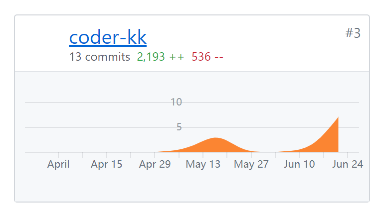

# 个人总结

* 在这次的大作业中我学习了微信小程序的开发，以及小程序端如何与后端对接协作进行数据的同步，还加深了使用git的熟练程度。同时，我也初步了解了一个项目从构想到最后的实现经历的完整的流程。
* 此处特别感谢[Kobe3](https://github.com/Kobe3)同学对于小程序端开发做出的努力以及对我们的指导，他就是我们的指路明灯，指引着我们开发的进行。

## 工作清单

* 完成小程序端merchantList,orderList,orderDetail页面的开发
* 进行后端API的测试
* 小程序原型设计，协作[UI设计](https://free.modao.cc/app/Y8tEwwdfS6TUp1M6gYnSVCllIQPXPxN#screen=sAFAFC5999B1525741519530)

## 个人分支git统计

## psp2.1统计表

|                PSP2.1                 |           PSP阶段            | 预估耗时(分) | 实际耗时(分) |
| :-----------------------------------: | :--------------------------: | :----------: | :----------: |
|               Planning                |             计划             |     100      |     200      |
|               Research                |           前期调研           |     120      |     300      |
|               Analysis                |           需求分析           |     200      |     330      |
|              Design Spec              |         生成设计文档         |     100      |     130      |
|             Design Review             |           设计复审           |      60      |     100      |
|            Coding Standard            |           代码规范           |     120      |     200      |
|                Design                 |           具体设计           |     300      |     400      |
|                Coding                 |           具体编码           |      -       |      -       |
|             Code Reiview              |           代码复审           |      -       |      -       |
|                 Test                  |             测试             |     120      |     300      |
|               Reporting               |             报告             |      60      |      80      |
|              Test Report              |           测试报告           |      60      |      80      |
|           Size Measurement            |          计算工作量          |      20      |      20      |
| Postmortem & Process Improvement Plan | 事后总结，并提出过程改进计划 |      40      |      50      |
|                                       |             合计             |     1300     |     2190     |