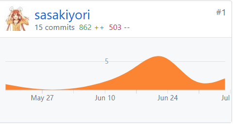
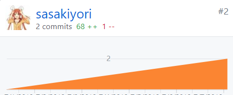

## 15331405-sasakiyori   Final Report

### 1. 个人总结

在这个项目里我主要负责商家平台的前端编程，负责处理订单、个人信息和菜单的上下线。学习了vue.js，相比之前学习的原生的html和js，收获了许多，也感受到了vue的魅力。
这里感谢[Richard](https://github.com/YinghongZhang)，在文档和需求方面、还有组织方面，给大家都提供了很多的帮助。在跟我一起进行Merchant的分支开发时，跟我交流到位，开发起来也很舒畅。

### 2. PSP 2.1 统计表(小组)

|                PSP2.1                 |     PSP阶段      | 预估耗时(分) | 实际耗时(分) |
| :-----------------------------------: | :------------: | :-----: | :-----: |
|               Planning                |       计划       |   90    |   100   |
|               Research                |      前期调研      |   120   |   130   |
|               Analysis                |      需求分析      |   120   |   130   |
|              Design Spec              |     生成设计文档     |   220   |   230   |
|             Design Review             |      设计复审      |   40    |   50    |
|            Coding Standard            |      代码规范      |   60    |   70    |
|                Design                 |      具体设计      |   120   |   130   |
|                Coding                 |      具体编码      |  2400   |  2400   |
|             Code Reiview              |      代码复审      |   20    |   30    |
|                 Test                  |       测试       |   90    |   100   |
|               Reporting               |       报告       |   90    |   100   |
|              Test Report              |      测试报告      |   70    |   80    |
|           Size Measurement            |     计算工作量      |   20    |   30    |
| Postmortem & Process Improvement Plan | 事后总结，并提出过程改进计划 |   40    |   50    |
|                                       |       合计       |  3500   |  3580   |

### 3. 个人分支的git报告
- 商家前端(Merchant)

- Dashboard

- github贡献格子图

### 4. 个人工作清单
- 参与API设计讨论、定型
- **使用vue.js完成web端商家后台**
	- 完成登录界面
	- 完成商家信息、商家菜单等商家类界面
	- 完成cookie配置以及http配置
	- 完成逻辑校验以及页面局部动态变化
- 参与系统流程图、顺序图等的设计和补充

### 5. 个人技术、博客类清单
- [vue.js初步学习](https://sasakiyori.github.io/2018/04/12/SAD-hw3.html)
- 

