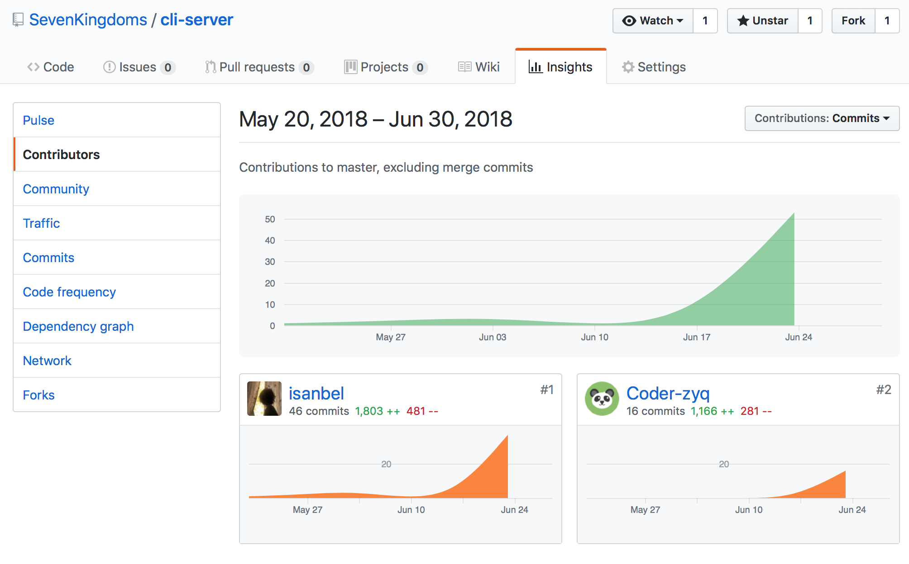
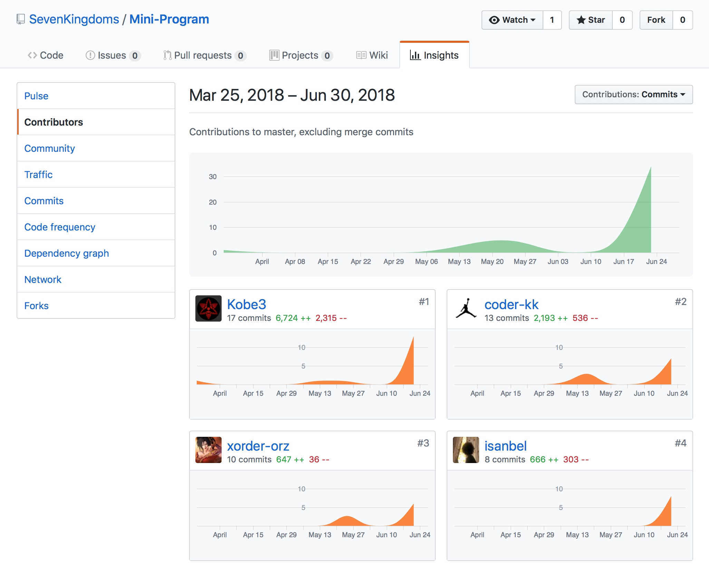

## 15331409-isanbel

### 1.个人总结

在这个项目里面我学习与实践了如何使用基于golang使用echo框架写后端、使用mysql存储数据，使用nginx部署服务器。学会了使用workbench。除了后端以外，也在写微信小程序的时候解决了过去的一些疑惑。

感谢[Coder-zyq](https://github.com/Coder-zyq)同学的协作，才让后端工作得以如期结束。他的勤劳与智慧，以及谦逊有礼的风范让人印象深刻。还感谢每一位队员的辛勤付出，才有了

### 2.个人分支的git统计报告

如下图：

### 3. 个人工作清单

* 使用课程知识进行数据结构设计、参与部分API文档设计。
* 使用echo完成后端架构。
* 使用jwt进行鉴权，用户被分为 0 - admin，1 - 用户， 2 - 商家。
* 在微信小程序端使用wx.request的封装来进行http请求，得以web请求全局携带token。
* 协作UI设计，[快点](https://free.modao.cc/app/Y8tEwwdfS6TUp1M6gYnSVCllIQPXPxN#screen=sAFAFC5999B1525741519530)

### 4. 个人的技术、博客类清单

* [Nginx配置SSL证书](https://isanbel.github.io/2018/04/15/Nginx配置SSL证书)
* [JWT验证与微信小程序http请求封装](https://isanbel.github.io/2018/06/30/JWT验证与微信小程序http请求封装)

### 5. PSP 2.1统计表

|                PSP2.1                 |     PSP阶段      | 预估耗时(分) | 实际耗时(分) |
| :-----------------------------------: | :------------: | :-----: | :-----: |
|               Planning                |       计划       |   90    |   100   |
|               Research                |      前期调研      |   120   |   130   |
|               Analysis                |      需求分析      |   120   |   130   |
|              Design Spec              |     生成设计文档     |   220   |   230   |
|             Design Review             |      设计复审      |   40    |   50    |
|            Coding Standard            |      代码规范      |   60    |   70    |
|                Design                 |      具体设计      |   120   |   130   |
|                Coding                 |      具体编码      |  2400   |  2400   |
|             Code Reiview              |      代码复审      |   20    |   30    |
|                 Test                  |       测试       |   90    |   100   |
|               Reporting               |       报告       |   90    |   100   |
|              Test Report              |      测试报告      |   70    |   80    |
|           Size Measurement            |     计算工作量      |   20    |   30    |
| Postmortem & Process Improvement Plan | 事后总结，并提出过程改进计划 |   40    |   50    |
|                                       |       合计       |  3500   |  3580   |

