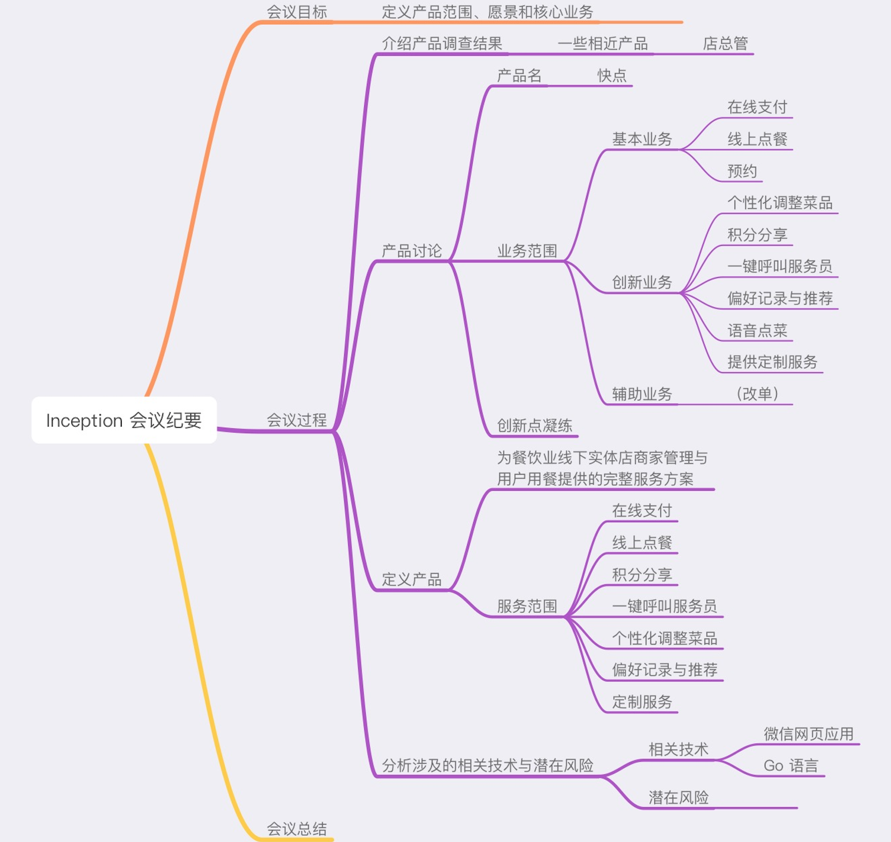

## Meeting Record

`2018/3/18`

会议目标：项目启动会议，讨论核心业务、辅助业务和创新业务等

### 议程

1. 我们做什么项目？
2. 项目核心业务是什么
3. 项目有什么创新的地方
4. 每个人在项目当中的工作
5. 接下来开会的频次和时间

### 确定内容

1. 项目业务

   扫码点餐小程序

2. 项目核心业务

   项目核心业务是能够扫码点餐，点餐过程可以参考一下点外卖过程添加购物车并提交订单支付这个过程

   实现这个核心业务，一是需要一个客户端能够让客户点餐，二是有商家端能够对接商家，才有对餐的对象

3.  每个人在项目中的工作

   项目经理（产品经理）、开发工程师、测试工程师、架构师

4. 开会的频次和时间

   一次迭代一次会议，时间尽量安排在晚上，避免上课时间和实习

### 会议记录

