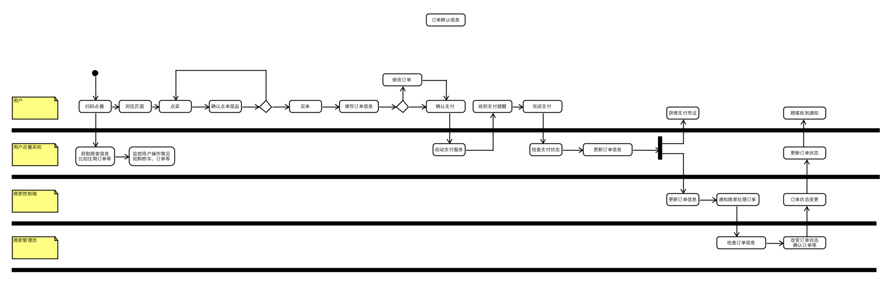
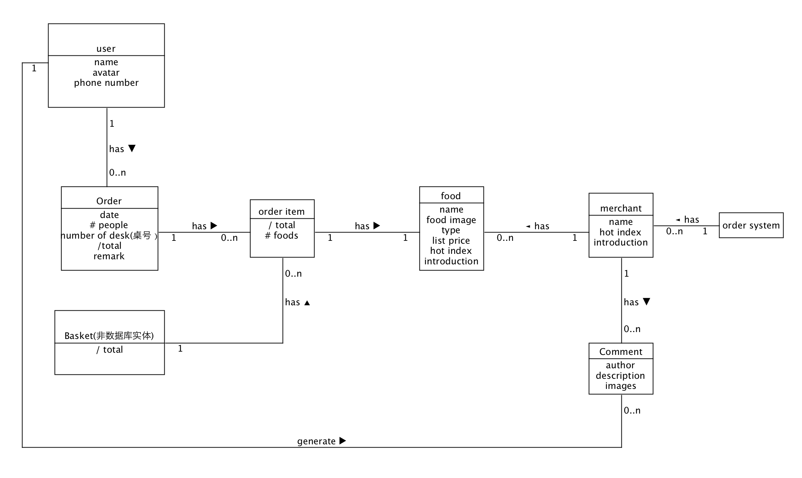
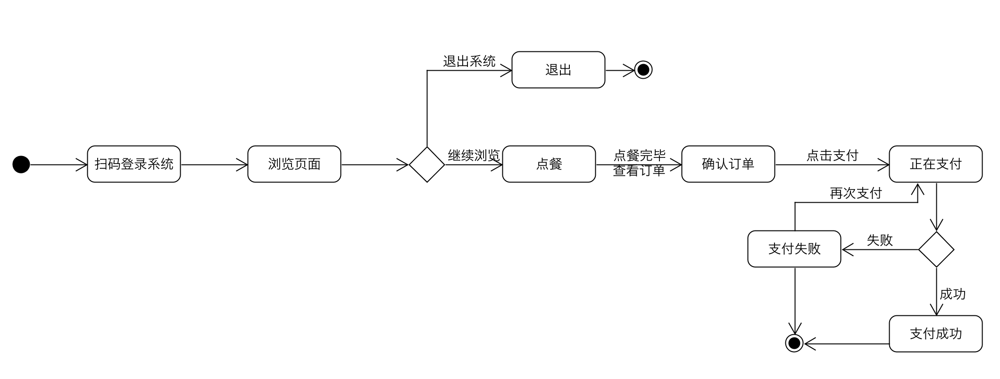



# 用例图

# 用例
### 系统边界
扫码点餐系统（包括用户界面以及后台商家管理界面）是要被设计的系统
除此以外，如支付服务等是系统边界之外的。
### 主要参与者
用户、管理员是使用点餐系统最主要的参与者。
### Brief 用例
1. 用户扫码进入点餐页面，选购物品加入购物车，结账支付，系统记录订单，检查支付情况发放支付凭证，更新商品库存，系统提醒管理员订单信息。
2. 用户进入点餐页面，进行退菜/加菜，并提交修改，系统检查修改项执行退款/支付操作，用户完成操作后系统检查支付情况告知用户执行情况，更新商品库存，提醒管理员订单信息。
3. 用户进入点餐页面，查看订单详情
4. 用户进入点餐页面，查看个人中心
5. 管理员进入订单管理界面，查看订单详情并选择更新订单状态，厨房收到订单信息后备菜

# Casul用例和Full用例
### Casual 用例

1. 扫码点餐

   主成功场景：用户扫码进入点餐平台订餐，选购完毕后支付。系统检查支付情况，记录订单，更新后台订单信息。

   交替场景：

   * 用户可以在订餐页面挑选菜品加入购物车，可任意跳转其他页面，系统记录保存用户的购物车信息
   * 对于库存为0的菜品，系统显示已售罄，用户无法选购
   * 如果由于网络通信问题无法展示菜单页面/完成支付服务，系统做出相应提示并告知用户呼叫服务员解决
   * 如果用户支付失败，系统提醒用户再次支付，重新调用支付服务
   * 如果用户无法使用线上支付，系统提醒用户到前台进行现金\刷卡结款

2. 用户退菜/加菜
   主成功场景：用户进入点餐页面进行加菜，或者进入订单详情页进行退菜操作，然后提交申请，系统检查退菜申请，执行支付/退款服务，检查支付情况，更新后台订单信息。
   交替场景：
   * 用户退的菜品和订单信息不符，则提示用户检查申请，并取消此次申请（保留申请信息）
   * 如果用户超过一定时间后操作退菜，则无法执行申请（退菜须在一定时间内）
   * 其他异常情况参照用例1
3. 管理员更新订单信息
   主成功场景：管理员登入订单管理界面，更新订单状态，系统根据更新的状态通知用户和后厨。
   交替场景：
   * 如果订单在未支付状态，则无法执行 “接收订单” 操作
   * 如果订单已支付但用户的点餐信息存在问题，则无法执行 “接收订单” 操作
   * 在一定时间内，用户订单属于锁定状态，若中途有退菜操作，则系统提交管理后台提醒，并在操作完成后更新订单信息
   * 管理员有权对用户订单执行退单操作，并提示用户退单详情

### Full 用例

**扫码点餐**
**范围：**快点点餐平台
**级别：**用户目标
**主要参与者：**用户
**涉众及其关注点：**
- 用户：希望能够清晰、便捷地看到菜品的介绍和价格，快速方便地下单支付，第一时间得到服务。在菜品基础介绍的情况下，希望能够看到更加美化的图片和更加真实地介绍。希望支付完成后有支付凭证，方便在订单出问题时能解决。
- 前台管理员：能够方便快捷地执行订单确认操作，清晰看到订单详情，希望系统能稳定地展现目前的订餐情况，在必要时做及时的提示。订单异常情况能够迅速、可靠地解决。
- 服务员：希望系统能易于用户学习，详尽并且清晰地呈现餐厅情况，减少服务员的人力成本。并且每个订单确保无误。上菜顺利。
- 厨师：希望订单详情的打印凭条清晰无误。容易查看并理解。
- 餐厅经营人：希望系统能很好衔接厨房、前台和用户，易于用户学习和操作，降低人力成本。希望系统有足够的稳定性，保证在餐厅顺利经营。
- 支付授权服务：希望接受到格式和协议正确的数字授权请求。希望准确计算对商店的应付款。
  **前置条件：**用户必须有订餐二维码并能进入正常的订餐页面。

**成功保证：**存储订单信息，准确计算商品价格，更新财务和库存信息，生成票据，打印订单信息，记录支付授权的批准。
**主成功场景：**

1. 用户扫码进入点餐平台
2. 用户开始浏览菜单并自行添加进入购物车，用户可在订餐平台任意页面内跳转
3. 系统记录购物车的商品信息，显示商品的份数、价格和累计额，并通过规则计算总价格
  **用户重复2步，直到跳入支付页面或者退出。
  以下是跳入支付页**
4. 系统显示订单的所有菜品信息和累计额，用户填写桌位号和人数，请用户付款；
5. 用户付款，系统处理支付
6. 系统记录订单信息，并将销售和支付信息等发送到订单管理系统
7. 系统打印支付凭证
8. 顾客离开点餐平台

**扩展（或替代流程）：**

a. 系统在任意时刻时失败
  为了支持回复和更正财务处理，要保证所有交互的敏感状态和事件都能够从场景中的任何一步完全回复
1. 管理员重启、登录、请求恢复到上次状态
2. 系统重建上次状态

b. 管理员在任意时刻修改订单状态
  管理员有权限在任意时刻修改订单状态，但必须遵循系统的订单状态变更规则。
1. 管理员登入订单管理系统
2. 依照规则变更订单状态
3. 系统通知顾客和厨房

1. 
  * a 用户支付时使用积分或者优惠券减免
    1. 系统核实优惠券和积分情况
    2. 系统确认是否可以使用优惠券
    3. 系统更新价格
  * b 用户需要去掉菜品中的一项
    1. 订单中的菜品可以修改份
    2. 用户修改完后系统更新价格
    3. 核实是否可以使用优惠券等
    4. 若有使用则按照4a更新价格
2. a 顾客因某些原因无法完成线上支付
    1. 订单状态更新为未支付
    2. 提示顾客到前台处理
3. a 管理员检查订单发现异常情况，如库存不足，商品信息错误等
    1. 一般情况下难以通过点餐小程序直接通知到客户，这个时候需要服务员到对应桌号通知顾客
    2. 征求顾客同意后，修改订单商品或者让顾客重新下单

**特殊需求：**
* 点餐系统必须能够适配不同尺寸的设备，文本信息可见距离在1米
* 餐厅前台使用大尺寸平面可触摸显示屏
* 系统在崩溃或者出现差错时，能够快速恢复或者报告异常情况

**发生频率：可能会不断发生**

**未决问题：**
* 远程服务如何恢复？
* 优惠券如何发放和使用？
* 积分制度？
* 前台可否支持信用卡/刷卡等支付方式？
* 点餐系统和厨房等等的衔接方式如何做到更加方便迅速，准确无误？

# 活动图

# 领域模型

# 状态模型

